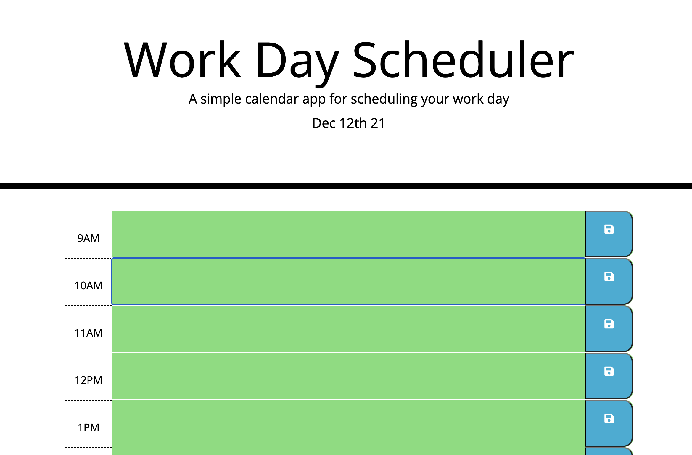

# work-day-scheduler

In this weeks challenge Javascript and jQuery were used to create a work day scheduler with different times. The schedule is based off the date and text canbe entered in the schdule. The times are colored based on past, present, future. The text is saved in local storage.

<li>https://heatherviolet.github.io/work-day-scheduler/</li>